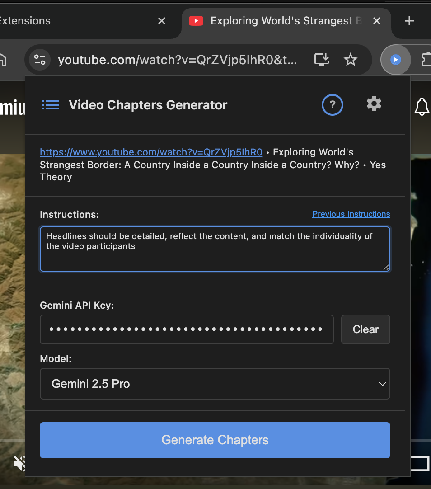

# Video Chapters Generator
*Free • Non-commercial • Open Source*

Transform any YouTube video into organized chapters with customizable AI-powered timecode generation using multiple AI providers.

## Features

* **One-Click Chapter Generation**: Generate chapters directly from YouTube video pages
* **Multiple AI Providers**: Google Gemini (direct API) or OpenRouter (DeepSeek R1, Claude, GPT-4o, Llama, and more)
* **Free Model Options**: Use DeepSeek R1 for free without requiring an API key
* **Custom Instructions**: Add personalized instructions to tailor chapter generation to your needs
* **Direct Video Navigation**: Jump directly to any chapter timestamp from the results page
* **Cross-Browser Support**: Works on both Chrome (Manifest V3) and Firefox (Manifest V2)
* **Session-Based Results**: Results are stored only for the current browser session
* **Open Source**: Full transparency with code available on GitHub

## Perfect For

* **Content creators, vloggers and streamers** organizing their videos
* **Students** creating study guides from educational content
* **Researchers** analyzing video content structure
* **Podcasters** converting video episodes to chapters
* **Anyone** wanting to make videos more navigable
* **Educators** creating lesson breakdowns

---

## Installation

### Chrome Web Store

*To be published*

### Firefox Web Store

*To be published*

### Firefox Add-on

Download the latest Firefox add-on (.xpi file) from the [GitHub Releases](https://github.com/dpolivaev/video-chapters-extension/releases) section and install it directly in Firefox.

### Manual Installation

For developers or advanced users, see [DEVELOPMENT.md](DEVELOPMENT.md) for manual installation instructions.

---

## Setup

### Model Selection & API Configuration

The extension supports multiple AI providers with different models:

#### Free Options (No API Key Required)
* **DeepSeek R1 Free**: Latest reasoning model, completely free to use

#### Gemini Models (Direct Google API)
* **Gemini 2.5 Pro**: Most capable model for complex analysis
* **Gemini 2.5 Flash**: Faster model optimized for speed

#### OpenRouter Models (Single API Key for Multiple Providers)
* **DeepSeek R1**: Advanced reasoning capabilities
* **Claude 3.5 Sonnet/Haiku**: Anthropic's powerful models
* **GPT-4o/GPT-4o Mini**: OpenAI's latest models
* **Llama 3.3 70B**: Meta's advanced open-source model
* **Gemini via OpenRouter**: Access Gemini through OpenRouter

### API Key Setup

#### Option 1: Use Free Models
1. Click the extension icon and select "DeepSeek R1 0528 (Free)"
2. No API key required - start generating chapters immediately!

#### Option 2: Gemini Direct API
1. Get a free Gemini API key from [Google AI Studio](https://aistudio.google.com/apikey)
2. **Note**: Gemini's free tier is sufficient for most users - no paid plan required
3. **Availability**: Gemini API is available in most countries. Users in supported regions should register for the free tier, which provides generous usage limits for chapter generation
4. Open extension options page and enter your Gemini API key
5. Select any Gemini model in the popup

#### Option 3: OpenRouter (Multiple Models)
1. Create a free account at [OpenRouter](https://openrouter.ai)
2. Generate an API key from your OpenRouter dashboard
3. Open extension options page and enter your OpenRouter API key  
4. Select any OpenRouter model in the popup

**Note**: API keys are stored securely in your browser's local storage and never leave your device except when sent to the respective AI service.

**Disclaimer**: No warranty is provided for external APIs and services. Free AI models may have usage limitations, rate limits, or availability restrictions that are beyond our control.

---

## Usage

### Generating Chapters

1. **Open any YouTube video** with captions
2. **Click the extension icon**
3. **Select your preferred AI model**
4. **Enter your API key** if you select a paid AI model (not required for free models)
5. **Add custom instructions** to guide chapter generation (optional)
6. **Click "Generate Chapters"**
7. **Copy formatted chapters** from the results page

### Example Custom Instructions

You can also try running without any custom instructions to see the default AI behavior. Use the extension button on the results page to easily modify instructions or change models for the same video.

- "Headlines should be brief yet meaningful, reflect the content, and match the individuality of the video participants. Additionally write a brief summary"
- "Headlines should be detailed, reflect the content, and match the individuality of the video participants"
- "For each headline, provide the main thesis in one sentence in [LANGUAGE] without prefixes like 'Thesis:'"
- "For each headline, provide both thesis and counter-argument"

### Instruction History

* **Save frequently used instructions** for easy reuse
* **Click on saved instructions** to automatically fill the input field
* **Delete instructions** you no longer need

### Results Management

* **View Results**: Opens results in a new tab (or focuses existing tab for the same generation)
* **Back to Video**: Smart navigation that returns to the original video tab
* **Copy Chapters**: Copy generated chapters with video URL included

---

## Privacy & Security

* **Data Transmission**: The extension sends YouTube video transcripts to your selected AI provider for chapter generation:
  - **Google Gemini models**: Data sent directly to Google's Gemini API (ai.google.dev)
  - **OpenRouter models**: Data sent to OpenRouter API (openrouter.ai), which forwards to the selected model provider (Anthropic, OpenAI, Meta, DeepSeek, etc.)
  - **User Control**: You explicitly choose which AI service processes your data by selecting the model
* **Local Storage Only**: All your settings and results are stored solely in your browser's local storage
* **No Extension Server**: The extension does not operate its own servers or collect any user data
* **Transcript Retrieval**: Subtitles are retrieved from YouTube using the same method the browser uses when users open the transcript panel
* **Minimal Permissions**: The extension requests only the permissions necessary for YouTube integration and session storage
* **Session-Only Results**: Generated chapters are stored only for the current browser session and are not persisted
* **API Key Security**: API keys are stored locally in your browser and only transmitted to their respective AI services

---

## License

This program is distributed in the hope that it will be useful, but WITHOUT ANY WARRANTY; without even the implied warranty of MERCHANTABILITY or FITNESS FOR A PARTICULAR PURPOSE.

It is licensed under the [GNU General Public License v3.0](https://www.gnu.org/licenses/gpl-3.0.html) or later.

---

## Recent Updates

### v2.0.0 - Multi-Provider AI Support

* **🚀 New Providers**: Added OpenRouter integration with 8+ AI models
* **🆓 Free Options**: DeepSeek R1 available for free without API key
* **🎯 Model Selection**: Choose from Gemini, Claude, GPT-4o, Llama, and more
* **🏗️ Modular Architecture**: Clean separation of AI providers with shared functionality
* **🔧 Smart UI**: Dynamic API key field based on selected model
* **📊 Provider Info**: Results page shows which model and custom instructions were used

---

## Acknowledgments

* Subtitle retrieval logic is based on code by **Hamza Wasim**, used with permission.

---

## Chrome Web Store Distribution

This extension is distributed under GPL v3.0 license, which is compatible with Chrome Web Store distribution. The extension:

* Contains proper copyright notices and attribution
* Includes complete source code access via GitHub repository
* **Data Transmission Disclosure**: Sends YouTube video transcripts to user-selected AI providers (Google Gemini API or OpenRouter API) for chapter generation only
* Uses established YouTube transcript extraction methods with author permission
* Maintains user privacy with local-only settings and session storage

---

## Development

For development-related information, please see [DEVELOPMENT.md](DEVELOPMENT.md).

---

## Screenshots

### Extension Interface

*Main extension popup showing custom instructions and API key configuration*

*Dropdown menu with multiple AI models from different providers*

### Generated Results

*Generated chapters with clickable timestamps for direct video navigation*

*Extracted video subtitles with copy functionality*

### Extension Settings

*Extension settings page for API key management and configuration*

### Advanced Features  

*Side-by-side workflow showing results page and popup for easy iteration*

*Instruction history management for saving and reusing custom prompts*
