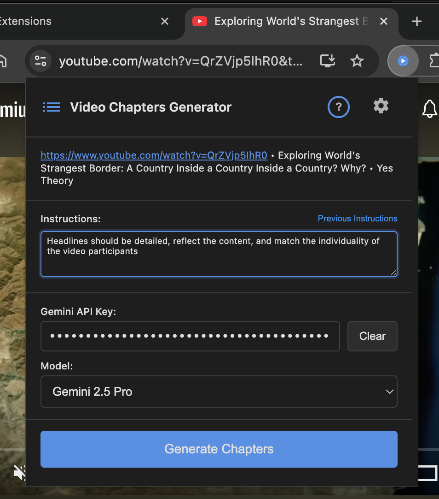
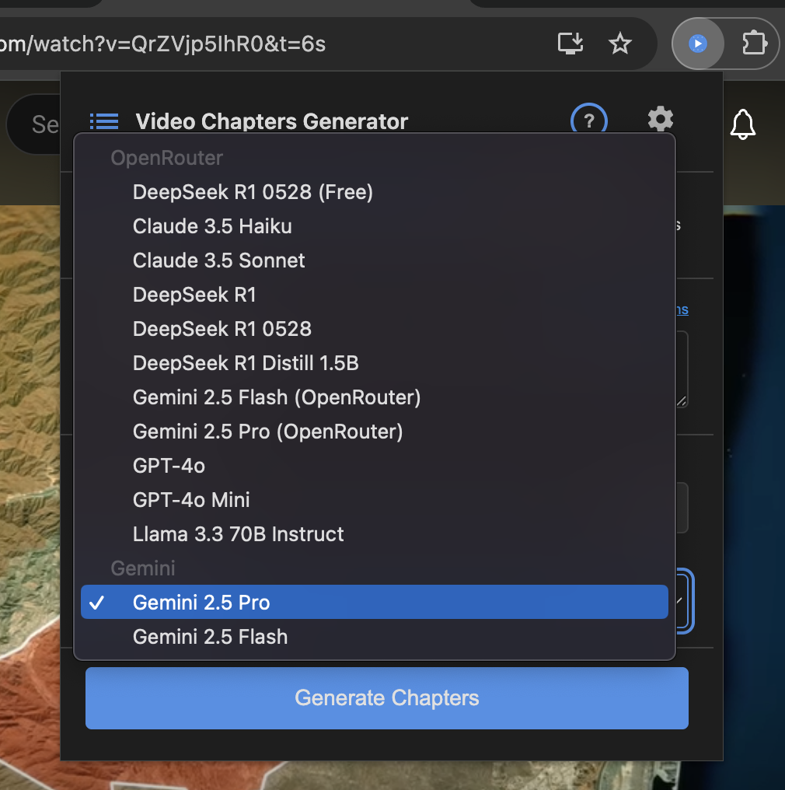
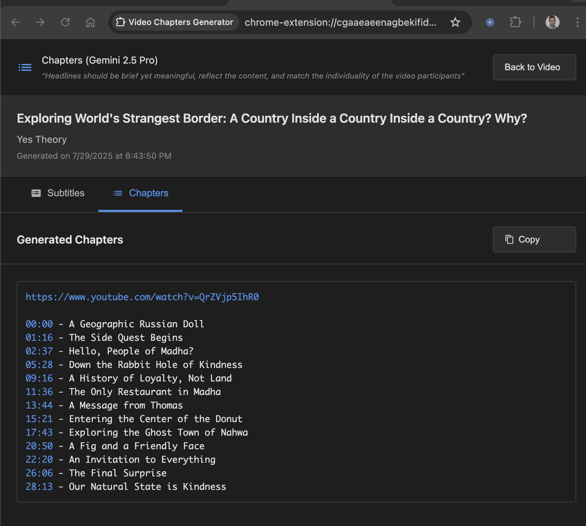
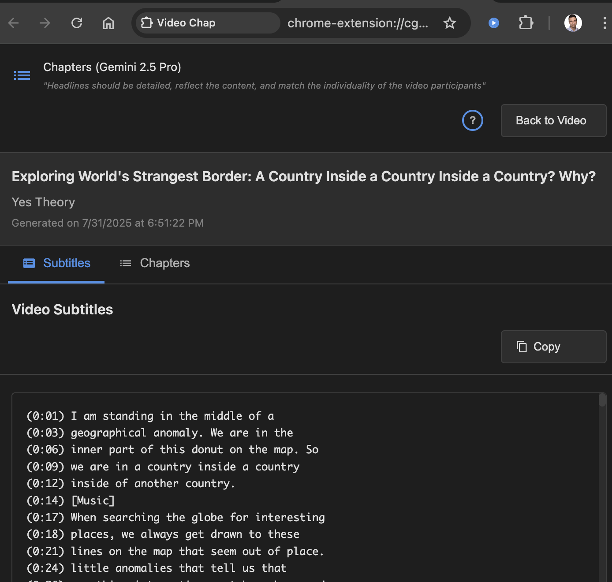
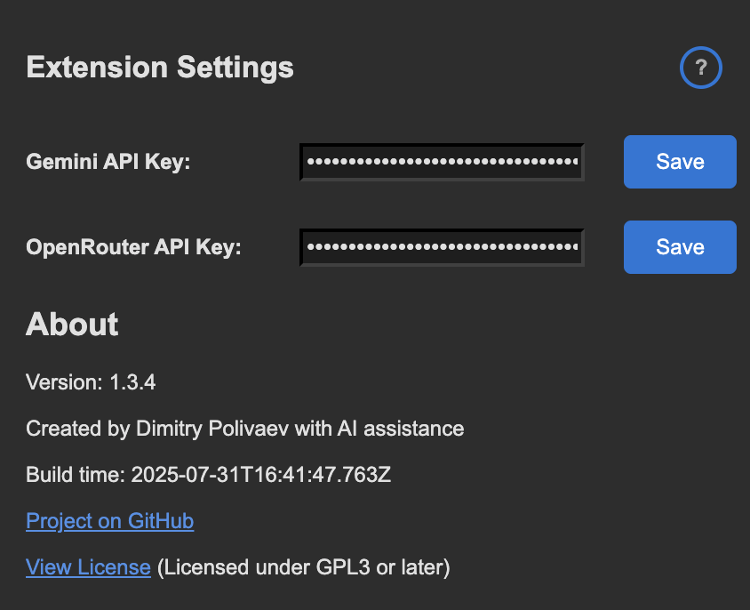
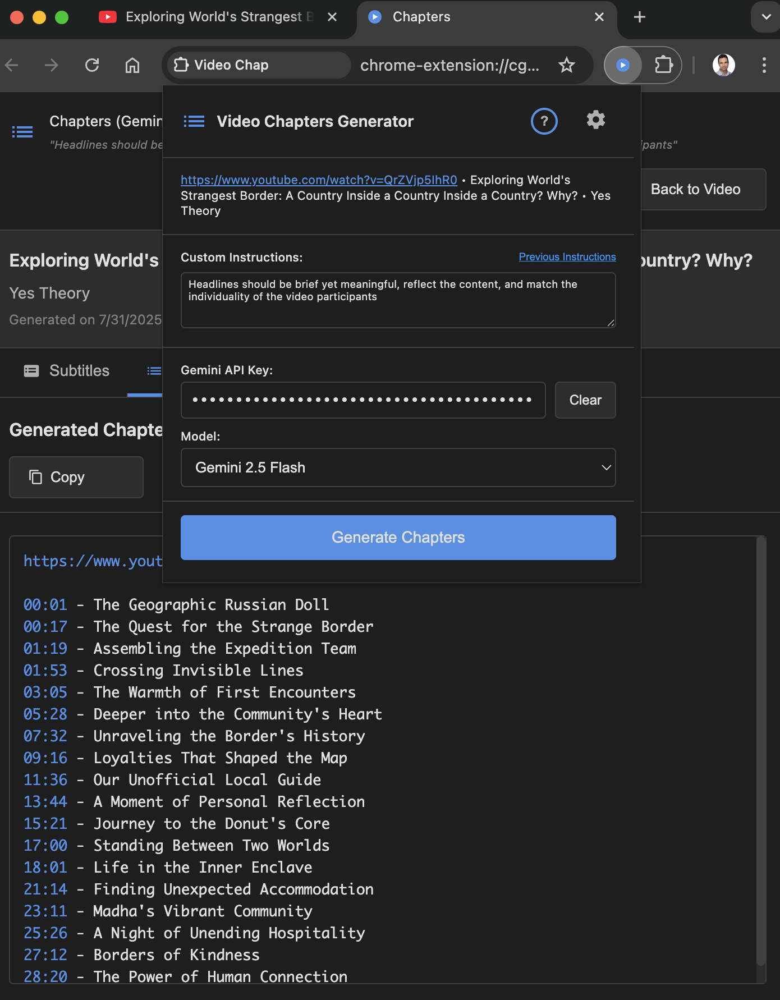
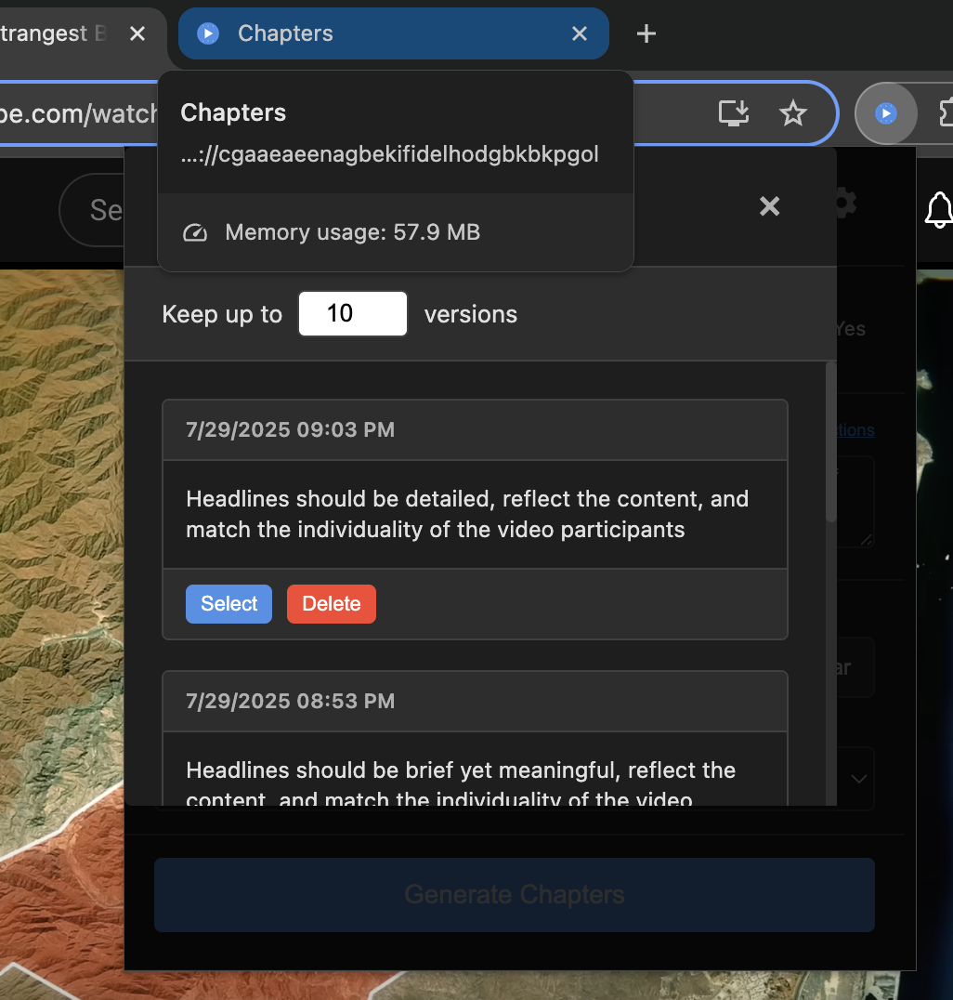

# Firefox Add-on Listing
*Free • Non-commercial • Open Source*

## Summary
Generate customizable AI-powered chapter timecodes for YouTube videos using multiple AI providers.

## Description
Transform any YouTube video into organized chapters with AI-powered timecode generation.

Video Chapters Generator automatically creates chapter timecodes for YouTube videos using advanced AI models. 
Choose from multiple AI providers including free options, add custom instructions, and get perfectly formatted chapters ready to use.

🎯 **MAIN FEATURES:**
• One-click chapter generation from YouTube videos
• Multiple AI providers: Google Gemini, OpenRouter (DeepSeek, Claude, GPT-4o, Llama)
• Free model options with no API key required
• Custom instructions for tailored chapter styles
• Direct video navigation from generated chapters page

⚙️ **AI MODEL OPTIONS:**
• **Gemini Direct**: Access Google's latest models with your API key from [Google AI Studio](https://aistudio.google.com/apikey)
• **OpenRouter**: Single API key for 8+ models (Claude, GPT-4o, Llama, etc.) from [OpenRouter](https://openrouter.ai)
• **Model Selection**: Choose the best AI for your content type and budget
• **Free Models**: DeepSeek R1 (completely free, no API key needed)
• **Custom Instructions**: Guide AI to create chapters matching your needs

🔍 **PERFECT FOR:**
• Content creators, vloggers and streamers organizing their videos
• Students creating study guides from educational content
• Researchers analyzing video content structure
• Podcasters converting video episodes to chapters
• Anyone wanting to make videos more navigable
• Educators creating lesson breakdowns

✨ **SMART & RELIABLE:**
• Session-based storage (no data persistence)
• Cross-browser compatibility (Chrome & Firefox)
• Privacy-focused: data only sent to your chosen AI provider
• Lightweight and fast
• Open source with full transparency

💡 **HOW TO USE:**
1. Open any YouTube video with captions
2. Click the extension icon
3. Select your preferred AI model
4. Enter your API key if you select a paid AI model (not required for free models)
   - **Gemini users**: Free tier is sufficient - no paid plan needed ([Get API key](https://aistudio.google.com/apikey))
   - **OpenRouter users**: Create free account for API access ([Sign up](https://openrouter.ai))
5. Add custom instructions to guide chapter generation (optional)
6. Click "Generate Chapters"
7. Copy formatted chapters from the results page

## Example Custom Instructions

You can also try running without any custom instructions to see the default AI behavior. Use the extension button on the results page to easily modify instructions or change models for the same video.

- "Headlines should be brief yet meaningful, reflect the content, and match the individuality of the video participants. Additionally write a brief summary"
- "Headlines should be detailed, reflect the content, and match the individuality of the video participants"
- "Write both the headline and its one-sentence thesis in [LANGUAGE], without adding prefixes like 'Thesis:'"
- "For each headline, provide both thesis and counter-argument"

🛡️ **PRIVACY & SECURITY:**
• No extension servers - all data stays local or goes to your chosen AI
• API keys stored securely in browser storage only
• You control which AI service processes your data
• Session-only results with no persistent storage
• Open source code available on GitHub

**Note:** This extension requires videos to have captions/transcripts available on YouTube. Free models may have usage limitations beyond our control.

---

## Categories
- Productivity
- Developer Tools

## Tags
youtube, chapters, timecodes, ai, transcripts, video, productivity, content-creation

## Permissions Justification

**activeTab**: Required to detect YouTube videos and extract transcript data from the current tab.

**storage**: Used to store user preferences (API keys, model selection, custom instructions) locally in the browser.

**scripting**: Needed to inject content scripts into YouTube pages for transcript extraction.

**background**: Required for the background script to coordinate between popup, content scripts, and results pages.

## Screenshots

**NOTE**: Firefox Add-on submission may require uploaded image files. Include these screenshots when submitting:

### 1. Extension Popup Interface (Main Screenshot)

*Main extension popup showing custom instructions and API key configuration for Gemini model*

### 2. Model Selection Dropdown  

*Dropdown menu displaying multiple AI models from different providers (OpenRouter and Gemini)*

### 3. Generated Chapters Results

*Generated chapters with clickable timestamps for direct video navigation*

### 4. Video Subtitles View
 
*Extracted video subtitles with copy functionality and tab interface*

### 5. Extension Settings Page

*Extension settings page for API key management and configuration*

### 6. Side-by-Side Workflow (Advanced Feature)

*Side-by-side workflow showing results page and popup for easy iteration and model comparison*

### 7. Instruction History Management

*Instruction history management for saving and reusing custom prompts*

**Screenshot Files**: All screenshots are available in the `screenshots/` directory with descriptive filenames for easy submission.

## Developer Comments
This extension is built with privacy and user control as core principles. All AI processing happens through user-selected providers with explicit consent. The extension uses established YouTube transcript extraction methods and maintains full transparency through open source code availability.